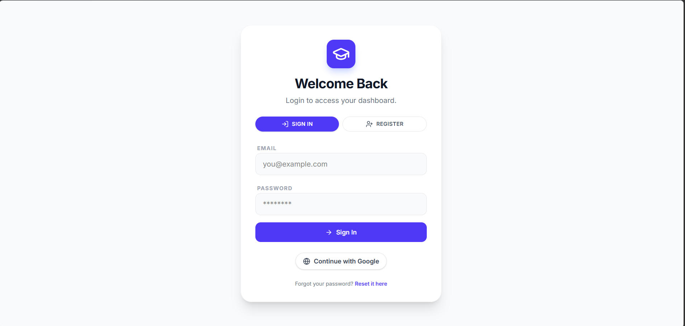
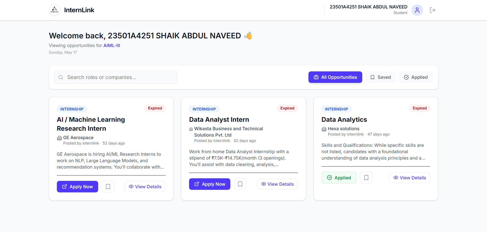
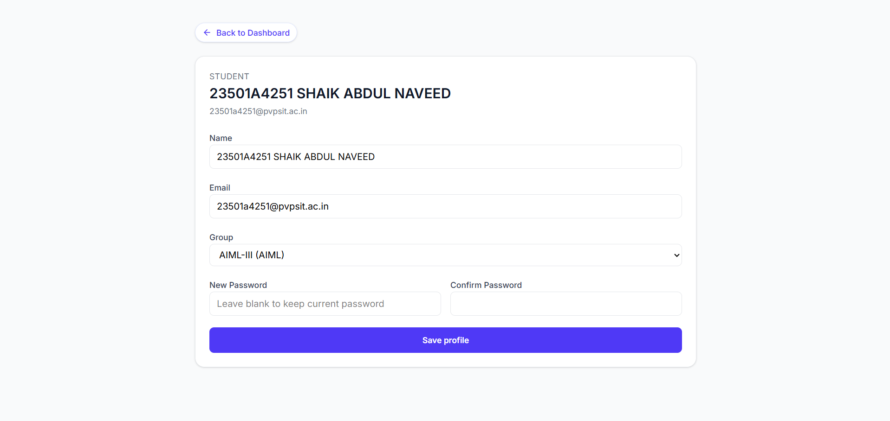
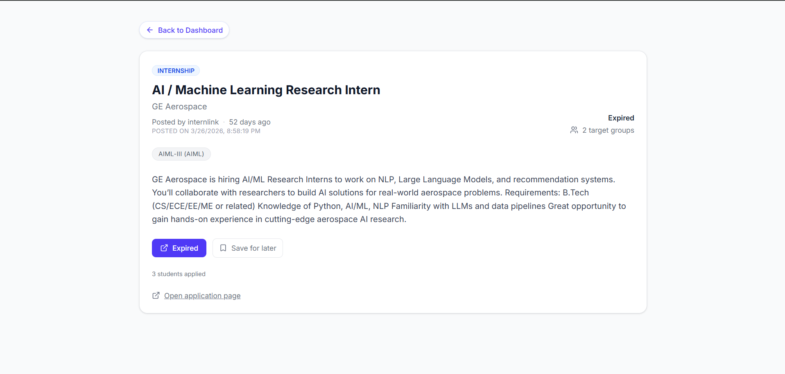
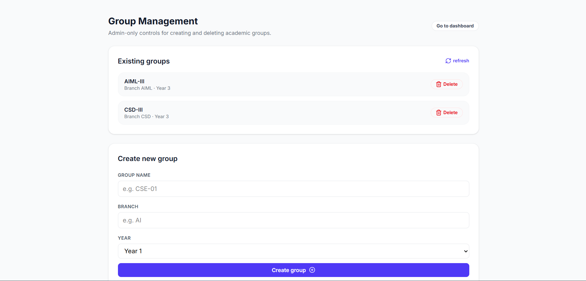

# InternLink

A full-stack internship and opportunity management platform built with the MERN ecosystem. InternLink helps students discover opportunities, manage profiles, collaborate in groups, and interact through a modern dashboard experience.

---

## 🚀 Features

* 🔐 Authentication & Authorization
* 👤 User Profile Management
* 📩 Email Verification & Password Recovery
* 📢 Opportunity Management System
* 👥 Group Management
* 🛠️ Admin Dashboard
* 📊 Interactive Dashboard UI
* ☁️ Firebase Integration
* 📱 Responsive Modern Interface

---






## 🧑‍💻 Tech Stack

### Frontend

* React 19
* Vite
* Tailwind CSS
* React Router DOM
* Firebase
* Recharts
* Lucide React
* React Hot Toast

### Backend

* Node.js
* Express.js
* MongoDB
* Mongoose
* Firebase Admin SDK
* JWT Authentication
* Express Middleware

---

## 📂 Project Structure

```bash
InternLink/
│
├── backend/
│   ├── config/
│   ├── controllers/
│   ├── middleware/
│   ├── models/
│   ├── routes/
│   ├── utils/
│   ├── app.js
│   └── package.json
│
├── frontend/
│   ├── components/
│   ├── pages/
│   ├── public/
│   ├── src/
│   ├── index.html
│   └── package.json
│
└── README.md
```

---

## 📄 Available Pages

### Frontend Pages

* Login Page
* Forgot Password
* Verify Email
* Main Dashboard
* User Profile
* Opportunity Details
* Admin Groups
* Admin Teacher Creation
* Not Found Page

---

## ⚙️ Installation & Setup

### 1️⃣ Clone the Repository

```bash
git clone https://github.com/abdul-naveed-git/InternLink.git
cd InternLink
```

---

## 🔧 Backend Setup

```bash
cd backend
npm install
```

### Create `.env` file

```env
PORT=5000
MONGODB_URI=your_mongodb_connection
FIREBASE_PROJECT_ID=your_project_id
FIREBASE_PRIVATE_KEY=your_private_key
FIREBASE_CLIENT_EMAIL=your_client_email
```

### Run Backend Server

```bash
npm run dev
```

Backend runs on:

```bash
http://localhost:5000
```

---

## 🎨 Frontend Setup

```bash
cd frontend
npm install
```

### Run Frontend

```bash
npm run dev
```

Frontend runs on:

```bash
http://localhost:5173
```

---

## 🔐 Authentication Flow

InternLink includes a secure authentication system with:

* User login
* Email verification
* Password reset
* Protected routes
* Firebase authentication integration

---

## 📊 Dashboard Functionalities

Users can:

* View internship opportunities
* Manage their profiles
* Access group features
* Track updates and notifications
* Explore opportunity details

Admins can:

* Manage groups
* Create teacher/admin accounts
* Monitor platform activities

---

## 🛡️ Security Features

* Helmet.js security middleware
* CORS protection
* Rate limiting
* Cookie parsing
* Environment variable protection
* Firebase Admin authentication

---

## 📦 Main Dependencies

### Backend

```json
Express.js
MongoDB
Mongoose
Firebase Admin
Helmet
Cors
Morgan
Dotenv
```

### Frontend

```json
React
Vite
Tailwind CSS
Firebase
React Router DOM
Recharts
```

---

## 🌐 Deployment Suggestions

### Frontend

* Vercel
* Netlify

### Backend

* Render
* Railway
* Cyclic

### Database

* MongoDB Atlas

---

## 📈 Future Improvements

* AI-based internship recommendations
* Resume analyzer integration
* Real-time chat system
* Interview preparation module
* Advanced analytics dashboard
* Role-based permissions

---

## 🤝 Contributing

Contributions are welcome.

1. Fork the repository
2. Create a new branch
3. Commit your changes
4. Push the branch
5. Open a Pull Request

---

## 📜 License

This project is licensed under the MIT License.

---

## 👨‍💻 Author

**Shaik Abdul Naveed**

* GitHub: [https://github.com/abdul-naveed-git](https://github.com/abdul-naveed-git)

---

## ⭐ Support

If you like this project, consider giving it a ⭐ on GitHub.
